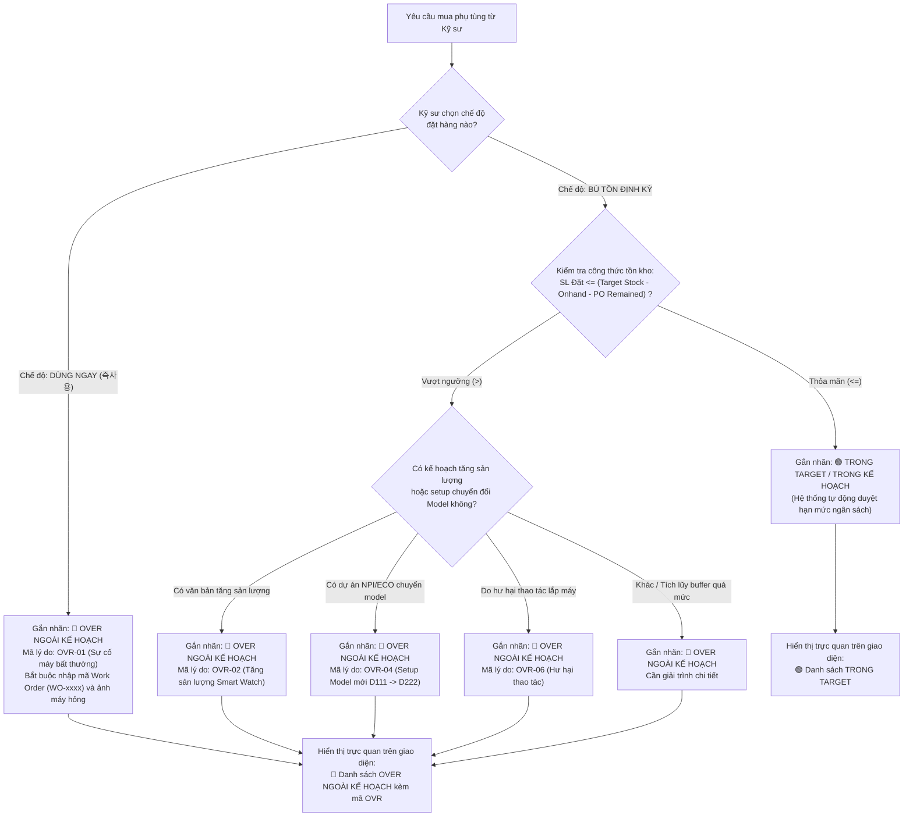

# 04. Sơ Đồ Quy Trình: Phân Loại Trong Target vs Over Ngoài Kế Hoạch

## 1. Lưu Đồ Quyết Định Phân Loại Tự Động (Decision Tree)

```mermaid
flowchart TD
    Start["Yêu cầu mua phụ tùng từ Kỹ sư"] --> CheckType{"Kỹ sư chọn chế độ\nđặt hàng nào?"}
    
    CheckType -->|"Chế độ: DÙNG NGAY (즉사용)"| FlagOverBreakdown["Gắn nhãn: 🔴 OVER NGOÀI KẾ HOẠCH\nMã lý do: OVR-01 (Sự cố máy bất thường)\nBắt buộc nhập mã Work Order (WO-xxxx) và ảnh máy hỏng"]
    
    CheckType -->|"Chế độ: BÙ TỒN ĐỊNH KỲ"| CheckMath{"Kiểm tra công thức tồn kho:\nSL Đặt <= (Target Stock - Onhand - PO Remained) ?"}
    
    CheckMath -->|"Thỏa mãn (<=)"| FlagInTarget["Gắn nhãn: 🟢 TRONG TARGET / TRONG KẾ HOẠCH\n(Hệ thống tự động duyệt hạn mức ngân sách)"]
    
    CheckMath -->|"Vượt ngưỡng (>)"| CheckPlanChange{"Có kế hoạch tăng sản lượng\nhoặc setup chuyển đổi Model không?"}
    
    CheckPlanChange -->|"Có văn bản tăng sản lượng"| FlagOverVol["Gắn nhãn: 🔴 OVER NGOÀI KẾ HOẠCH\nMã lý do: OVR-02 (Tăng sản lượng Smart Watch)"]
    CheckPlanChange -->|"Có dự án NPI/ECO chuyển model"| FlagOverModel["Gắn nhãn: 🔴 OVER NGOÀI KẾ HOẠCH\nMã lý do: OVR-04 (Setup Model mới D111 -> D222)"]
    CheckPlanChange -->|"Do hư hại thao tác lắp máy"| FlagOverDam["Gắn nhãn: 🔴 OVER NGOÀI KẾ HOẠCH\nMã lý do: OVR-06 (Hư hại thao tác)"]
    CheckPlanChange -->|"Khác / Tích lũy buffer quá mức"| FlagOverMisc["Gắn nhãn: 🔴 OVER NGOÀI KẾ HOẠCH\nCần giải trình chi tiết"]

    FlagInTarget --> UI_Display["Hiển thị trực quan trên giao diện:\n🟢 Danh sách TRONG TARGET"]
    FlagOverBreakdown & FlagOverVol & FlagOverModel & FlagOverDam & FlagOverMisc --> UI_OverDisplay["Hiển thị trực quan trên giao diện:\n🔴 Danh sách OVER NGOÀI KẾ HOẠCH kèm mã OVR"]
```

