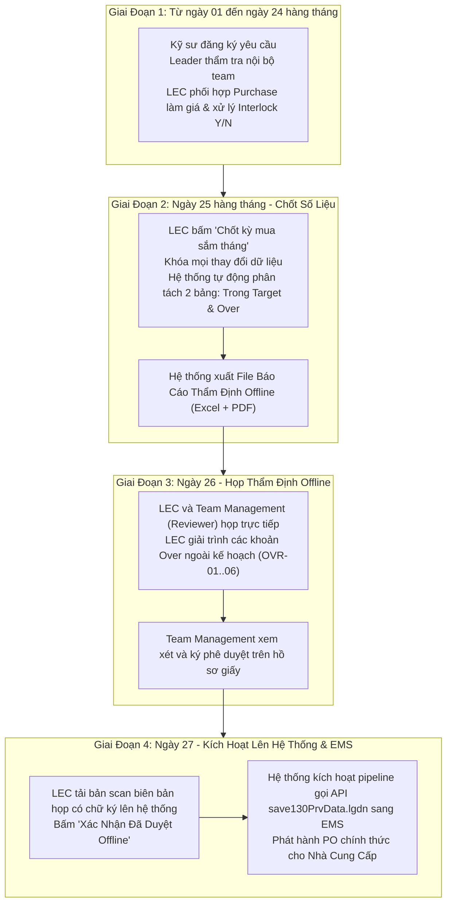

# 05. Sơ Đồ Quy Trình: Chốt Kỳ Tháng & Thẩm Định Offline Với Management

## 1. Dòng Thời Gian Vận Hành Kỳ Mua Sắm Tháng (Timeline)

```mermaid
flowchart TD
    subgraph Phase1["Giai Đoạn 1: Từ ngày 01 đến ngày 24 hàng tháng"]
        P1["Kỹ sư đăng ký yêu cầu\nLeader thẩm tra nội bộ team\nLEC phối hợp Purchase làm giá & xử lý Interlock Y/N"]
    end

    subgraph Phase2["Giai Đoạn 2: Ngày 25 hàng tháng - Chốt Số Liệu"]
        P2["LEC bấm 'Chốt kỳ mua sắm tháng'\nKhóa mọi thay đổi dữ liệu\nHệ thống tự động phân tách 2 bảng: Trong Target & Over"]
        P3["Hệ thống xuất File Báo Cáo Thẩm Định Offline (Excel + PDF)"]
    end

    subgraph Phase3["Giai Đoạn 3: Ngày 26 - Họp Thẩm Định Offline"]
        P4["LEC và Team Management (Reviewer) họp trực tiếp\nLEC giải trình các khoản Over ngoài kế hoạch (OVR-01..06)"]
        P5["Team Management xem xét và ký phê duyệt trên hồ sơ giấy"]
    end

    subgraph Phase4["Giai Đoạn 4: Ngày 27 - Kích Hoạt Lên Hệ Thống & EMS"]
        P6["LEC tải bản scan biên bản họp có chữ ký lên hệ thống\nBấm 'Xác Nhận Đã Duyệt Offline'"]
        P7["Hệ thống kích hoạt pipeline gọi API save130PrvData.lgdn sang EMS\nPhát hành PO chính thức cho Nhà Cung Cấp"]
    end

    Phase1 --> Phase2
    P2 --> P3 --> Phase3
    P4 --> P5 --> Phase4
    P6 --> P7
```

